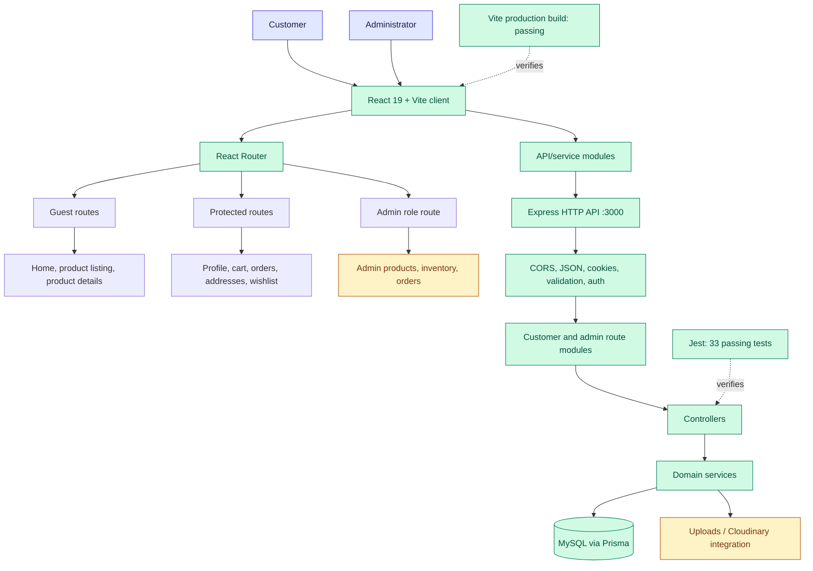

# Shopping Cart Project Status

**Assessment date:** 2026-10-04  
**Branch:** `dev`  
**Repository:** `IvinMathewAbraham/Shopping-Cart`

## Executive summary

The project is an active full-stack e-commerce application. The current branch contains a working React/Vite client, an Express API, Prisma/MySQL data modeling, authentication, customer shopping flows, and a growing set of admin capabilities. The repository is synchronized with `origin/dev`.

The current automated checks are green:

- Backend: **33 tests passed across 6 test suites**
- Frontend: **production Vite build succeeded**
- Git state at assessment time: **clean and synchronized** (`dev...origin/dev`, 0 ahead, 0 behind)

The main remaining delivery gaps are broader end-to-end coverage, operational documentation, and completing or exposing the product areas represented in the data model but not yet surfaced through the current route/page inventory.

## Architecture and status diagram

**Legend:** green indicates implemented and validated at the repository level; amber indicates implemented foundations or integration that still needs broader product/operational verification; indigo indicates external actors.

## Current implementation inventory

### Frontend

- React 19 application bundled with Vite.
- Browser routing with guest, authenticated, and role-based route guards.
- Customer pages for home, product listing, product details, login, registration, profile, and cart.
- Product UI components for galleries, variants, filters, pagination, reviews, specifications, and related products.
- Authentication and cart state contexts.
- API/service modules for authentication, addresses, cart, orders, brands, categories, inventory, products, and uploads.
- Admin product-management page and supporting admin route protection.

Primary entry points:

- [client/src/App.jsx](./client/src/App.jsx)
- [client/src/context/AuthContext.jsx](./client/src/context/AuthContext.jsx)
- [client/src/context/CartContext.jsx](./client/src/context/CartContext.jsx)
- [client/src/routes/](./client/src/routes/)
- [client/src/pages/](./client/src/pages/)

### Backend

- Express server with CORS, cookie parsing, JSON/form parsing, static upload serving, 404 handling, and centralized error handling.
- Authentication endpoints for registration, login, logout, current-user lookup, and profile update.
- Customer endpoints for products, categories, brands, cart, wishlist, addresses, and orders.
- Admin endpoints for product management, inventory, and order status/detail management.
- Validator and authentication middleware.
- Service/controller separation for address, auth, brand, cart, category, inventory, order, product, and wishlist domains.
- Health endpoints, including a database health check.

Primary entry points:

- [server/index.js](./server/index.js)
- [server/routes/](./server/routes/)
- [server/controllers/](./server/controllers/)
- [server/services/](./server/services/)
- [server/middleware/](./server/middleware/)
- [server/validators/](./server/validators/)

### Data and integrations

- Prisma schema configured for MySQL.
- Core entities include users/roles, addresses, products, images, attributes, variants, inventory, carts, orders, wishlists, reviews, promotions, refunds, returns, tickets, notifications, and related history/audit entities.
- Product image upload support through local upload serving and Cloudinary configuration.
- Seed and database setup scripts are present.

References:

- [prisma/schema.prisma](./prisma/schema.prisma)
- [server/config/](./server/config/)
- [server/scripts/](./server/scripts/)
- [.env.example](./.env.example)
- [client/.env.example](./client/.env.example)

## Verification snapshot

| Check | Result | Notes |
|---|---:|---|
| Backend unit/integration tests | PASS | 6 suites, 33 tests |
| Frontend production build | PASS | Vite build completed successfully |
| Git branch synchronization | PASS | `dev` matches `origin/dev` |
| Working tree | CLEAN at assessment time | Report creation adds this file afterward |
| CI workflow configuration | NOT PRESENT | No `.github/workflows` files found |
| Live database/API smoke test | NOT RUN | Requires a running configured MySQL/database environment |

Test coverage currently includes:

- Authentication behavior and middleware
- Cart behavior
- Order behavior
- Request validators
- Utility functions

Tests are located in [__tests__/](./__tests__/).

## Delivery assessment

### Completed or in place

1. Full-stack application skeleton and local development scripts.
2. Customer authentication and protected shopping flows.
3. Product browsing and product-management foundations.
4. Cart, checkout/order creation, address, wishlist, and order-history foundations.
5. Admin inventory and order-management API foundations.
6. Prisma schema and database setup/seed tooling.
7. Passing backend tests and frontend production build.

### Needs follow-up before production release

1. Add CI checks for tests and frontend builds; no workflow configuration is currently present.
2. Add browser-level end-to-end tests for registration/login, browsing, cart, checkout, and admin authorization.
3. Run and document a real database-backed smoke test using a non-development secret configuration.
4. Review route/page parity for schema-backed capabilities such as reviews, returns/refunds, promotions, notifications, support tickets, and reporting.
5. Replace development defaults in deployment environments, especially the JWT secret and database credentials.
6. Expand operational documentation for migrations, seeding, uploads, Cloudinary, deployment, and rollback procedures.

## Recommended next milestone

**Release-readiness hardening:** add CI, run database-backed end-to-end tests, verify the critical customer purchase path, and document production configuration. This should happen before treating the current green unit/build status as production readiness.

## Amazon benchmark: missing capabilities

This is a product-scope comparison, not a claim that Cartigo should reproduce Amazon's infrastructure or every regional program. Amazon's customer experience currently emphasizes search/discovery, reviews, fast purchase and payment choices, delivery visibility, returns, repeat purchasing, and customer support. Its seller experience additionally emphasizes fulfillment, promotions/advertising, seller performance, and consolidated operations. Sources consulted:

- [Amazon: making search and shopping easier](https://www.aboutamazon.com/news/retail/amazon-makes-it-easier-to-search-and-shop)
- [Amazon Customer Service: finding products](https://www.amazon.com.be/-/en/gp/help/customer/display.html?nodeId=GSUNWNFT2ALMPR3L)
- [Amazon Customer Service: placing an order](https://www.amazon.com/gp/help/customer/display.html?nodeId=TM0z2tvxdI4nu36ypt)
- [Amazon: homepage shopping features](https://www.aboutamazon.com/news/retail/amazon-homepage-redesign-features)
- [Amazon Seller Central](https://sell.amazon.com/tools/seller-central)
- [Amazon Fulfillment by Amazon](https://sell.amazon.com/fulfillment-by-amazon)

### Gap matrix

| Priority | Amazon-like capability | Cartigo evidence today | Gap / recommended addition |
|---|---|---|---|
| P0 | Complete payment checkout | Provider-agnostic mock checkout is available with address validation, paid/failed states, retained cart on failure, payment references, and receipt API | Add a real payment adapter/webhooks and payment-intent persistence when a provider is selected |
| P0 | Delivery promise and live tracking | Shipping API exposes standard/express methods, rates, delivery windows, and order tracking references | Add persistent shipment/package entities, carrier integration, and notification events |
| P0 | Returns, replacements, refunds | Customer return requests and admin approval/rejection/completion APIs use the existing return/refund schema | Add replacement fulfillment, return labels, inventory restock automation, and customer UI |
| P0 | Production account/security readiness | Login/register rate limits, protected routes, production JWT-secret guard, and session/verification schema foundations exist | Add email delivery, password reset/verification flows, refresh-token rotation, and audit logging |
| P1 | Rich search and discovery | Product listing, categories, brands, filters, and pagination are present | Add full-text search, typo tolerance, relevance ranking, facets, suggestions, recent searches, visual/voice search only if strategically needed |
| P1 | Reviews that drive trust | Review UI components and review-related schema exist, but no review API/page route is present | Add verified-purchase reviews, rating aggregation, photo reviews, helpful votes, moderation/reporting, and review summaries |
| P1 | Personalization and recommendations | Related-product UI exists; recommendation/history schema exists | Add recently viewed, personalized home/category recommendations, “frequently bought together,” and measurable recommendation events |
| P1 | Promotions and pricing tools | Coupon/promotion schema exists; no corresponding route/page inventory is present | Add coupons, campaign rules, product/category promotions, expiry/eligibility validation, price history, and admin scheduling |
| P1 | Customer support and notifications | Ticket/notification schema exists; no customer support or notification route/page is present | Add help center, order issue flow, contact/ticket messaging, email/in-app notifications, and support/admin queues |
| P1 | Better cart conversion | Cart CRUD exists | Add guest cart, merge-on-login, “Buy now,” save-for-later, stock reservation, cart abandonment recovery, and checkout validation |
| P2 | Repeat purchasing | Order history is part of the intended customer flow | Add one-click reorder, subscriptions/recurring deliveries, delivery-frequency management, and replenishment reminders |
| P2 | Comparison and shopping lists | Wishlist exists | Add multiple lists/gift registry, side-by-side product comparison, shareable lists, and price/stock alerts |
| P2 | Seller/marketplace operations | Single-admin product, inventory, and order foundations exist | If multi-vendor is a goal, add seller accounts/onboarding, seller-specific catalog/offers, commissions, settlements, seller performance, and seller messaging |
| P2 | Fulfillment operations | Inventory and image uploads exist | Add fulfillment method selection, warehouse/location stock, pick-pack-ship workflow, shipping labels, split shipments, and delivery exception handling |
| P2 | Seller growth and analytics | No CI or broad reporting/analytics surface is present | Add sales/conversion/funnel dashboards, low-stock alerts, bulk catalog tools, coupons/deals, advertising hooks, and scheduled exports |

### What is already reasonably covered

Cartigo already has the foundations for several Amazon-style basics:

- Product catalog, category/brand browsing, product detail UI, filtering, and pagination
- Authentication, protected customer routes, and admin authorization
- Cart, wishlist, addresses, order creation, order history, and admin order status
- Product variants, inventory foundations, uploads, and a broad Prisma data model

The important distinction is that several capabilities are **modeled but not wired end-to-end**. A schema table or UI component should not be treated as delivered until it has a route, service/controller behavior, validation, user-facing flow, and automated coverage.

### Recommended implementation order

1. **Close the purchase loop:** shipment methods, delivery estimates, real-provider payment adapter/webhooks, and receipt generation.
2. **Close the post-purchase loop:** order timeline, tracking, notifications, returns, replacements, and refunds.
3. **Improve trust and conversion:** reviews, verified purchase signals, search quality, recommendations, promotions, and guest-cart merge.
4. **Add operational scale:** support tooling, analytics, bulk catalog/inventory operations, fulfillment workflows, and CI.
5. **Only then consider marketplace breadth:** multi-vendor seller accounts, commissions, settlements, advertising, and advanced programs.
