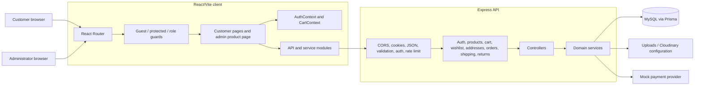
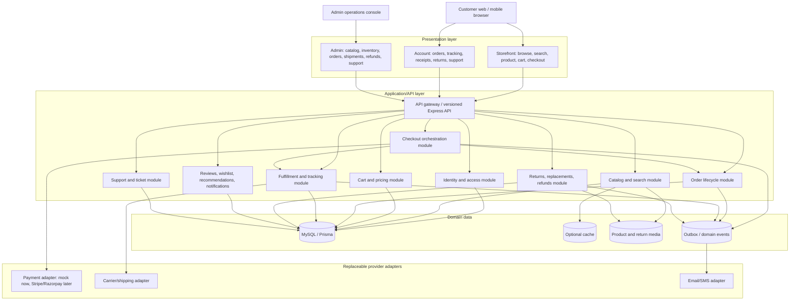
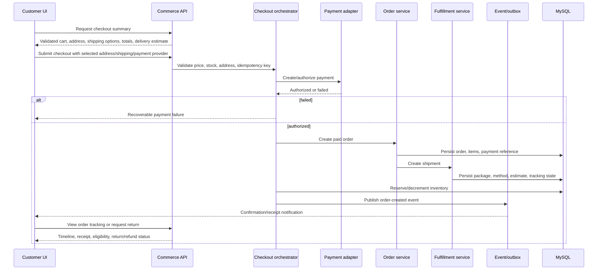
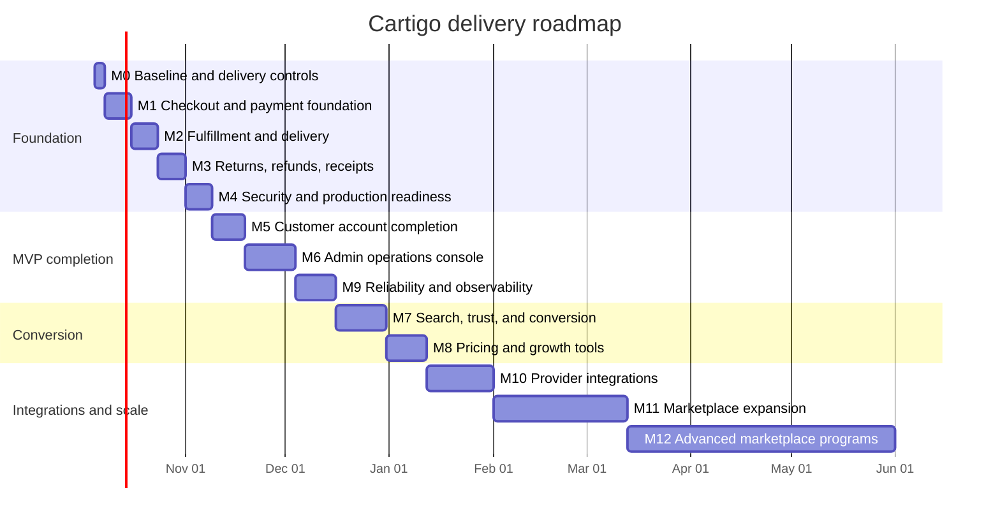

# Cartigo System Design Models

**Assessment date:** 2026-10-04  
**Repository:** `IvinMathewAbraham/Shopping-Cart`

This document separates the **implemented system** from the **target system**. The target model is intentionally provider-agnostic: it supports the current mock payment flow and leaves clear boundaries for a real payment provider, carrier, email, and notification integrations later.

## 1. Current system design

### Current architecture



### Current customer checkout flow

```mermaid
sequenceDiagram
    participant C as CartPage
    participant API as Express API
    participant O as Order service
    participant P as Mock payment
    participant DB as Prisma/MySQL

    C->>API: GET /addresses
    C->>API: GET /shipping
    C->>API: POST /orders/checkout
    API->>O: Validate user, address, cart, shipping method
    O->>P: Authorize mock payment
    alt payment fails
        P-->>O: 402 failure
        O-->>C: Error; cart remains available
    else payment succeeds
        P-->>O: PAID + reference
        O->>DB: Create order and items
        O->>DB: Decrement inventory atomically
        O->>DB: Clear cart
        O-->>C: Created order
    end
```

### Current implemented surfaces

| Layer | Current implementation |
|---|---|
| Client | React 19, Vite, React Router, CSS components |
| Client state | Authentication and cart contexts |
| Customer UI | Home, listing, details, login/register, profile, addresses, wishlist, cart |
| Admin UI | Product management page; no complete admin operations console |
| API | Express route/controller/service structure |
| Auth | JWT cookie or bearer token, protected routes, admin role checks |
| Commerce | Products, variants, inventory decrement, cart, wishlist, addresses, orders |
| Checkout | Mock payment, address validation, standard/express shipping, delivery window |
| Post-purchase API | Order detail, receipt JSON, tracking reference, return request, admin return status |
| Data model | Broad Prisma/MySQL schema including orders, returns, refunds, notifications, tickets, reviews, and sessions |
| Verification | 33 backend tests passing; frontend production build passing |

### Current design limitations

1. The order, shipment, payment, and return lifecycles are not yet modeled as complete independent aggregates.
2. Shipping estimates and tracking references are generated by application code rather than persisted shipment records.
3. Mock payment is synchronous and has no webhook or reconciliation path.
4. Receipt, tracking, return, and refund APIs are not all connected to customer/admin screens.
5. Email verification, password reset, refresh-token rotation, and audit logging are not complete flows.
6. Inventory is decremented during order creation, but reservation, cancellation restoration, and return restocking are incomplete.
7. There is no CI workflow or production observability boundary.
8. The database schema is substantially broader than the routes and pages that currently expose it.

## 2. Target system design

### Target architecture



### Target purchase and post-purchase flow



## 3. Target domain boundaries

### Identity and security

- Short-lived access token plus rotating refresh/session token.
- Email verification and password reset using expiring, single-use records.
- Login/register/password-reset rate limits.
- Role and permission checks at the API boundary.
- Audit events for authentication, admin changes, refunds, inventory, and status changes.

### Catalog and discovery

- Product, category, brand, variant, image, attribute, and inventory read models.
- Search endpoint with pagination, filters, sorting, suggestions, and later full-text indexing.
- Product review and verified-purchase checks.
- Recommendation and recently-viewed events separated from transactional order data.

### Checkout and pricing

- A single checkout summary calculates item totals, shipping, discounts, taxes, and final total.
- Server remains authoritative for all prices and stock.
- Idempotency key prevents duplicate orders on retry.
- Payment adapter interface:

```text
PaymentProvider
  createPaymentIntent(amount, currency, metadata)
  authorizePayment(intentId)
  handleWebhook(payload, signature)
  refundPayment(paymentReference, amount)
```

- The current `MOCK` provider implements the same boundary without external credentials.

### Orders and fulfillment

- Order records the immutable purchase snapshot.
- Shipment records method, fee, estimated window, package state, carrier, and tracking number.
- Order status and shipment status are separate but related lifecycles.
- Inventory reservation, fulfillment, cancellation, and return restock are explicit operations.

### Returns and refunds

- Customer requests eligible order-item quantities with a reason.
- Admin approves/rejects and chooses refund or replacement.
- Refund adapter uses the original payment reference.
- Return status history, refund status, label, inspection, and restock outcomes are auditable.

## 4. Target API grouping

```text
/api/v1/auth
/api/v1/catalog
/api/v1/search
/api/v1/cart
/api/v1/checkout
/api/v1/orders
/api/v1/shipments
/api/v1/returns
/api/v1/reviews
/api/v1/notifications
/api/v1/support
/api/v1/admin/catalog
/api/v1/admin/inventory
/api/v1/admin/orders
/api/v1/admin/returns
/api/v1/admin/reports
```

The existing unversioned routes can remain as a compatibility layer while `/api/v1` is introduced incrementally.

## 5. Migration from current to target

1. **Finish the current checkout slice**
   - Add checkout-summary endpoint and idempotency key.
   - Persist payment and shipment records.
   - Connect order detail, receipt, tracking, and return APIs to UI.

2. **Complete post-purchase operations**
   - Add shipment timeline and notifications.
   - Add return/refund/replacement screens.
   - Add admin return, refund, shipment, and inventory screens.

3. **Harden identity and operations**
   - Add verification/reset flows, refresh-token rotation, audit log, CI, structured logging, and health checks.

4. **Improve conversion**
   - Add search quality, reviews, promotions, recommendations, guest-cart merge, and reorder.

5. **Introduce replaceable providers**
   - Implement a real payment adapter and webhook endpoint.
   - Implement carrier and email adapters behind the existing service boundaries.

## 6. Design acceptance criteria

The target design should be considered operationally complete only when:

- A customer can browse, select delivery, pay, retry a failed payment, and receive a durable order.
- Duplicate checkout requests cannot create duplicate orders.
- A customer can view order status, tracking, receipt, and return eligibility in the UI.
- Admins can manage catalog, stock, fulfillment, returns, refunds, and support from the UI.
- Payment, shipment, inventory, and return state changes are auditable.
- External payment/carrier/email providers can be swapped without changing customer-facing domain logic.
- Backend tests, frontend build, end-to-end purchase tests, and CI checks are all passing.

## 7. Delivery estimate and milestones

### Estimate assumptions

These are implementation estimates for one developer using the existing codebase, with AI assistance, and assuming no major redesign of the database or frontend framework. They exclude waiting time for payment-provider, carrier, email, hosting, legal, or business decisions.

- **P0 release-ready commerce:** approximately **6-9 weeks**
- **Strong e-commerce MVP:** approximately **12-18 weeks**
- **Amazon-inspired platform foundation:** approximately **26-40 weeks**
- **Amazon-scale parity:** not a finite feature milestone; it requires a multi-team, multi-year investment in operations, logistics, search, personalization, trust, and reliability

The estimates are ranges, not commitments. Integration failures, schema migration complexity, and production acceptance testing can add 20-40%.

### Milestone roadmap

| Milestone | Estimate | Scope | Exit criteria |
|---|---:|---|---|
| M0: Baseline and delivery controls | 2-3 days | Confirm environment setup, database migration strategy, API conventions, CI skeleton, error/logging conventions, and test fixtures | Fresh setup is documented; backend tests and frontend build run in CI; database health check is usable |
| M1: Checkout and payment foundation | 1-1.5 weeks | Checkout summary, authoritative totals, shipping selection, mock payment adapter, failure/retry behavior, idempotency protection, payment/order persistence | A customer can safely retry checkout; duplicate requests do not create duplicate orders; payment and order states are queryable |
| M2: Fulfillment and delivery | 1-1.5 weeks | Shipment/package entities, standard/express methods, delivery estimates, shipment status, tracking reference, cancellation stock restoration | Customer sees delivery estimate and order timeline; admin can update fulfillment state; inventory transitions are covered |
| M3: Returns, refunds, and receipts | 1-1.5 weeks | Customer return UI, item-level eligibility, admin review UI, refund/replacement decision, receipt download/email-ready representation | Customer can request a return; admin can resolve it; refund state and receipt are visible and auditable |
| M4: Security and production readiness | 1-1.5 weeks | Email verification, password reset, refresh/session rotation, rate limits, audit logging, secure production configuration, structured errors | Account recovery works; sensitive actions are audited; production startup fails safely with invalid secrets/configuration |
| M5: Customer account completion | 1-2 weeks | Order detail/tracking UI, receipt action, returns UI, notifications center, support/contact flow, responsive/accessibility pass | Customer can complete the full lifecycle in the UI without API-only steps |
| M6: Admin operations console | 2-3 weeks | Catalog, inventory, orders, shipments, returns/refunds, customers, support queue, role/permission controls | Admin can operate the store without direct database/API calls; destructive actions are protected and logged |
| M7: Search, trust, and conversion | 2-3 weeks | Full-text search, suggestions, facets, verified reviews, moderation, recommendations, recently viewed, guest-cart merge | Search and review flows are usable on mobile; conversion-critical events are measurable |
| M8: Pricing and growth tools | 1.5-2.5 weeks | Coupons, promotions, price rules, deals, low-stock alerts, reorder, saved lists, price/stock notifications | Promotion calculations are server-authoritative, tested, and visible in checkout and admin |
| M9: Reliability and observability | 1.5-2.5 weeks | CI gates, end-to-end suite, structured logs, metrics, tracing/correlation IDs, backups, migration/rollback runbooks, load smoke tests | Deployments are repeatable; failures are diagnosable; critical purchase path has automated regression coverage |
| M10: Provider integrations | 2-4 weeks per provider | Real payment adapter/webhooks, carrier adapter, email/SMS provider, reconciliation and retry jobs | Providers can be enabled through configuration without changing checkout domain logic |
| M11: Marketplace expansion | 4-8 weeks | Seller accounts, onboarding, seller catalog/offers, commissions, settlements, seller performance, seller messaging | Multiple sellers can operate independently with correct ownership, money flows, and reporting |
| M12: Advanced marketplace programs | 8-16+ weeks | Fulfillment networks, split shipments, multi-warehouse stock, advertising hooks, brand stores, subscriptions, analytics/exports | Advanced programs have operational owners, financial reconciliation, and scale/load evidence |

### Recommended sequence



The dates in the diagram are illustrative working dates, not release promises. M7 and M8 can begin earlier if the team has separate frontend capacity, but they should not delay the purchase, fulfillment, return, and production-hardening milestones.

### Milestone priorities

#### Release 1: P0 commerce release — 6-9 weeks

Ship M0 through M5. This is the minimum useful release for a reliable single-store experience:

- Customer can browse, select an address and delivery method, pay in mock mode, recover from payment failure, and place an order.
- Customer can view tracking, receipt, return eligibility, and return status in the UI.
- Admin can resolve orders and returns.
- Authentication and production configuration have baseline hardening.

#### Release 2: Strong e-commerce MVP — 12-18 weeks

Ship M6 through M9:

- Admin operations are UI-complete.
- Search, reviews, recommendations, promotions, and guest-cart conversion features are available.
- CI, end-to-end tests, observability, backups, and deployment runbooks are in place.

#### Release 3: Provider-backed operation — add 2-4 weeks per provider

Ship M10 only after the mock flow passes the same contract tests:

- Replace mock payment with a selected provider.
- Add signed webhook processing and reconciliation.
- Add carrier and email/SMS integrations behind adapters.

#### Release 4: Marketplace and advanced programs — 3-9+ months

Ship M11 and M12 only if the product strategy requires multi-vendor or Amazon-like programs. These milestones introduce financial, legal, logistics, support, and operational complexity that is much larger than adding screens or routes.

### Planning rule

Do not mark a milestone complete because an endpoint or schema exists. Mark it complete only when the capability has:

1. A user or admin UI path.
2. Server-side validation and authorization.
3. Durable data and state transitions.
4. Failure and retry behavior.
5. Automated tests.
6. Documentation and operational ownership.
